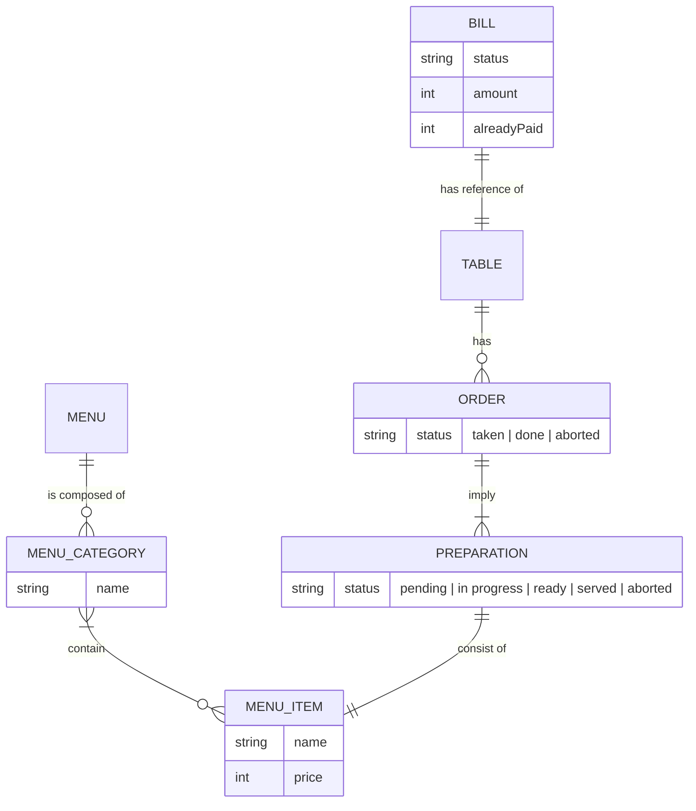

## ENTITY RELATIONSHIP

```mermaid
erDiagram
    MENU  ||--o{ MENU_CATEGORY : "is composed of"
    MENU_CATEGORY }|--o{ MENU_ITEM : contain

    MENU_CATEGORY {
        string name
    }

    MENU_ITEM {
	    string name
	    int price
    }

    TABLE ||--o{ ORDER : has
    ORDER ||--|{ PREPARATION: imply
    ORDER{
        string status "taken | done | aborted"
    }
    
    PREPARATION ||--|| MENU_ITEM : "consist of"
    PREPARATION {
        string status "pending | in progress | ready | served | aborted"
    }

    BILL{
        string status
        int amount
        int alreadyPaid
    }
    BILL ||--|| TABLE : "has reference of"
```