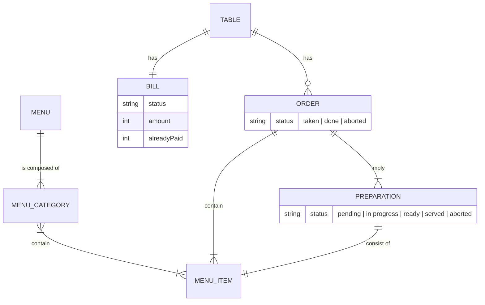

## ENTITY RELATIONSHIP

```mermaid
erDiagram
    MENU  ||--|{ MENU_CATEGORY : "is composed of"
    MENU_CATEGORY }|--|{ MENU_ITEM : contain

    TABLE ||--|| BILL : has
    TABLE ||--o{ ORDER : has
    ORDER ||--|{ MENU_ITEM : contain
    ORDER ||--|{ PREPARATION: imply
    ORDER{
        string status "taken | done | aborted"
    }
    
    PREPARATION ||--|| MENU_ITEM : "consist of"
    PREPARATION {
        string status "pending | in progress | ready | served | aborted"
    }

    BILL{
        string status
        int amount
        int alreadyPaid
    }
```